# 🧠 ClearMind — AI Metacognition Engine

> **Detects and Corrects Cognitive Biases in LLM Outputs in Real Time**

[](https://github.com/BimalaWijekoon/ClearMind/actions)
[](LICENSE)
[](https://python.org)

ClearMind is a research-grade AI reliability layer that watches an LLM's own reasoning chain, classifies which cognitive bias is present, and actively corrects the output before showing it to the user. Unlike traditional AI safety approaches that focus on preventing harmful content, ClearMind targets **epistemically harmful outputs** — biased reasoning and miscalibrated confidence.

## 📑 Research

**Research Angle:** Metacognitive Bias Detection and Correction in Large Language Models using Multi-Agent Architectures

**Target:** 19th International Research Conference 2026

**Novel Contributions:**
1. Real-time sycophancy detection via opposite-stance rephrasing in an agent loop
2. Recursive bias checking on debiased outputs (catching correction-introduced biases)
3. A custom sycophancy detection dataset of 500 labeled question pairs

## 🏗️ Architecture

```mermaid
graph TB
    User[👤 User Query] --> FE[⚛️ React Frontend]
    FE -->|WebSocket| API[🌐 FastAPI Backend]
    
    subgraph Pipeline["🔄 ClearMind Pipeline"]
        BA[🤖 Base Agent<br/>Gemini 2.0 Flash + CoT] --> MA[🔍 Monitor Agent<br/>RoBERTa + 8 Detectors]
        MA --> DA[🛠️ Debias Agent<br/>Bias-Specific Correction]
        DA --> PC[✅ Post-Check Monitor<br/>Recursive Bias Check]
    end
    
    API --> BA
    PC --> API
    
    MA --> CL[📊 Classifier<br/>Fine-tuned RoBERTa]
    MA --> RD[📐 Rule Detectors<br/>8 Bias Types]
    
    API --> DB[(🐘 PostgreSQL)]
    API --> Cache[(⚡ Redis)]
    
    style Pipeline fill:#1a1a2e,stroke:#7c3aed,stroke-width:2px
    style BA fill:#0d1117,stroke:#06b6d4
    style MA fill:#0d1117,stroke:#f59e0b
    style DA fill:#0d1117,stroke:#10b981
    style PC fill:#0d1117,stroke:#ef4444
```



## 🎯 Cognitive Biases Detected

| # | Bias | Detection Method | Correction Strategy |
|---|------|-----------------|-------------------|
| 1 | **Confirmation Bias** | Sentiment analysis on CoT trace | Force counterarguments before conclusion |
| 2 | **Anchoring Bias** | spaCy NER numerical anchor extraction | Strip anchors and re-query |
| 3 | **Availability Heuristic** | TF-IDF example diversity scoring | Require statistically representative examples |
| 4 | **Sycophancy** | Opposite-stance rephrasing comparison | Present both stances neutrally |
| 5 | **Overconfidence** | Hedging language parser + contested topics | Add uncertainty quantification |
| 6 | **Framing Effect** | Positive/negative frame comparison | Neutral reframing |
| 7 | **Recency Bias** | Temporal citation analysis via NER | Proportional time-period weighting |
| 8 | **Bandwagon Effect** | Consensus language pattern matching | Require specific evidence |

## 🛠️ Tech Stack

| Component | Technology |
|-----------|-----------|
| LLM | Gemini 2.0 Flash (Google Generative AI SDK) |
| Agent Framework | LangChain 0.3 + LangGraph |
| Bias Classifier | Fine-tuned RoBERTa-base (HuggingFace) |
| Embeddings | all-mpnet-base-v2 (sentence-transformers) |
| NLP | spaCy en_core_web_sm |
| Backend | FastAPI (async) |
| Database | PostgreSQL 16 + Redis 7 |
| Frontend | React 18 + TypeScript + Tailwind CSS |
| Containers | Docker + Docker Compose |
| Experiment Tracking | MLflow |
| Testing | pytest + Jest |

## 🚀 Quick Start

### Prerequisites
- Python 3.11+
- Node.js 18+
- Docker Desktop (for PostgreSQL & Redis)
- Gemini API Key ([Get free key](https://aistudio.google.com/))

### 1. Clone & Setup Backend

```bash
git clone https://github.com/BimalaWijekoon/ClearMind.git
cd clearmind

# Create Python virtual environment
cd backend
python -m venv venv
venv\Scripts\activate  # Windows
# source venv/bin/activate  # Linux/Mac

# Install dependencies
pip install -r requirements.txt
python -m spacy download en_core_web_sm

# Configure environment
copy .env.example .env
# Edit .env and add your GOOGLE_API_KEY
```

### 2. Start Infrastructure

```bash
# From project root
docker-compose up -d postgres redis mlflow
```

### 3. Start Backend

```bash
cd backend
uvicorn app.main:app --reload --host 0.0.0.0 --port 8000
```

### 4. Setup & Start Frontend

```bash
cd frontend
npm install
npm run dev
```

### 5. Open in Browser

Navigate to `http://localhost:5173`

## 📓 Notebooks

Run these in order to train and evaluate the system:

| # | Notebook | Purpose |
|---|----------|---------|
| 1 | `01_dataset_eda.ipynb` | Exploratory analysis of BBQ, TruthfulQA, CrowS-Pairs |
| 2 | `02_generate_sycophancy_dataset.ipynb` | Generate novel sycophancy detection dataset |
| 3 | `03_bias_classifier_training.ipynb` | Fine-tune RoBERTa bias classifier |
| 4 | `04_calibration_experiments.ipynb` | Temperature & Platt scaling calibration |
| 5 | `05_agent_pipeline_experiments.ipynb` | Prototype and test agent pipeline |
| 6 | `06_full_evaluation_benchmark.ipynb` | Full system evaluation on benchmarks |

## 📊 Evaluation Results

> Results will be populated after running the evaluation notebooks.

| Metric | Base LLM | ClearMind | Δ |
|--------|----------|-----------|---|
| TruthfulQA Accuracy | TBD | TBD | TBD |
| Bias Detection F1 | — | TBD | — |
| ECE (before calibration) | — | TBD | — |
| ECE (after calibration) | — | TBD | — |
| Avg. Pipeline Latency | — | TBD | — |

## 📁 Project Structure

```
clearmind/
├── backend/
│   ├── app/
│   │   ├── agents/          # Base, Monitor, Debias agents + LangGraph orchestrator
│   │   ├── bias/            # RoBERTa classifier + 8 rule-based detectors
│   │   ├── calibration/     # Temperature & Platt scaling
│   │   ├── embeddings/      # Sentence similarity (all-mpnet-base-v2)
│   │   ├── models/          # Pydantic schemas + SQLAlchemy ORM
│   │   ├── db/              # Database connection & CRUD
│   │   ├── api/             # FastAPI routes + WebSocket
│   │   ├── utils/           # Text processing + paraphrasing
│   │   ├── main.py          # FastAPI app entry
│   │   └── config.py        # Settings management
│   ├── notebooks/           # 6 Jupyter notebooks
│   ├── tests/               # pytest test suite
│   ├── ml_models/           # Saved model weights (after training)
│   └── data/                # Datasets (after download)
├── frontend/
│   └── src/
│       ├── components/      # 7 React components
│       ├── pages/           # 3 pages (Home, Dashboard, Evaluation)
│       ├── hooks/           # WebSocket + bias analysis hooks
│       └── api/             # Axios client
├── docker-compose.yml
└── README.md
```

## 📄 License

MIT License — see [LICENSE](LICENSE) for details.

## 📖 Citation

```bibtex
@inproceedings{clearmind2026,
  title={ClearMind: Metacognitive Bias Detection and Correction in Large Language Models using Multi-Agent Architectures},
  author={Bimala Wijekoon},
  year={2026},
  note={Submitted to 19th International Research Conference 2026}
}
```
